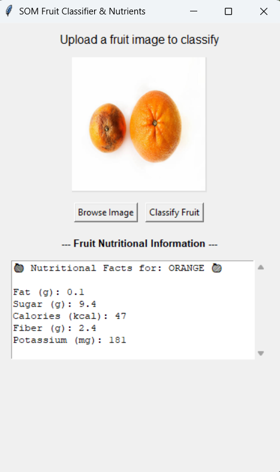

# 🍎 Smart Fruit Classifier: specific SOM Implementation

A computer vision application that utilizes **Unsupervised Learning (Self-Organizing Maps)** to classify fruit images and retrieve their nutritional profiles in real-time.




## 📋 Overview
This project demonstrates the application of **Artificial Neural Networks (ANN)**—specifically a **MiniSom** implementation—to cluster and identify high-dimensional image data. Unlike standard CNNs (Supervised Learning), this model learns the topology of the input data without explicit labels during the feature extraction phase, organizing similar fruits into specific neighborhoods on a 10x10 grid.

Once classified, the application queries a structured dataset (Pandas) to display macronutrients (Fat, Sugar, Calories) for the identified fruit.

## 🚀 Key Features
* **Unsupervised Training:** Uses a Self-Organizing Map (SOM) to reduce image vectors (64x64 RGB) into a 2D topology.
* **Optimized Inference (O(1)):** Implements a **Label Map** strategy. Instead of calculating distance to every training sample during prediction (Linear Time), the model maps neurons to labels once, allowing for instant constant-time classification.
* **Outlier Detection:** Features a "Quantization Error" threshold. If an image is too statistically distant from known clusters, it is flagged as an "Unidentified Object" rather than forcing a wrong prediction.
* **Model Persistence:** Automatically saves the trained model (`som_model.pkl`) using Pickle, ensuring the application launches instantly without re-training on subsequent runs.
* **Interactive GUI:** Built with **Tkinter** for easy image uploading and data visualization.

## 🛠️ Tech Stack
* **Language:** Python 3.x
* **Machine Learning:** `MiniSom` (Self-Organizing Maps), `NumPy`
* **Data Manipulation:** `Pandas`
* **Image Processing:** `Pillow (PIL)`
* **GUI:** `Tkinter`

## 📂 Project Structure
```text
├── assets/                  # Screenshots and static assets
├── data/
│   └── fruits/              # Training images (structured by folder name)
├── app.py                   # Main application entry point
├── fruit_nutrients.csv      # Nutritional dataset
├── som_model.pkl            # Serialized trained model (Auto-generated)
├── requirements.txt         # Python dependencies
└── README.md                # Project documentation

```

## ⚙️ Installation & Usage

1.  **Clone the Repository**
    ```bash
    git clone [https://github.com/your-username/fruit-som-classifier.git](https://github.com/your-username/fruit-som-classifier.git)
    cd fruit-som-classifier
    ```

2.  **Install Dependencies**
    ```bash
    pip install -r requirements.txt
    ```

3.  **Run the Application**
    ```bash
    python app.py
    ```
    *Note: The first run will take a few moments to train the model. Subsequent runs will load the saved `.pkl` file instantly.*

## 🧠 How It Works (Technical Detail)

### 1. Vectorization & Normalization
Input images are resized to `64x64` and flattened into a 1D vector (12,288 dimensions). Pixel values are normalized to a `[0, 1]` range to ensure faster convergence during training.

### 2. The Self-Organizing Map (SOM)
We initialize a **10x10 competitive grid**. During training (5,000 iterations):
* **Competition:** For every input vector, the neuron with the most similar weight vector is declared the "Winner" (Best Matching Unit - BMU).
* **Adaptation:** The weights of the BMU and its neighbors are adjusted to look more like the input vector.

This creates a "topological map" where apples cluster in one corner and bananas in another.

### 3. Fast Classification Logic
To optimize performance, we avoid recalculating distances against the entire training set during prediction.
* **Training Phase:** We generate a dictionary `{Neuron_Coordinates: Majority_Label}`.
* **Inference Phase:** We simply find the winning neuron for the new image and look up its label in the dictionary. This reduces complexity from $O(N)$ to $O(1)$.

## 📊 Dataset
The model is trained on a custom dataset containing the following classes:
`Apple`, `Banana`, `Orange`, `Dragon Fruit`, `Lichi`, `Mango`, `Pineapple`, `Watermelon`, `Guava`, `Jackfruit`.

## 🤝 Contributing
Contributions, issues, and feature requests are welcome! Feel free to check the [issues page](link-to-issues).

## 📝 License
This project is licensed under the MIT License.
